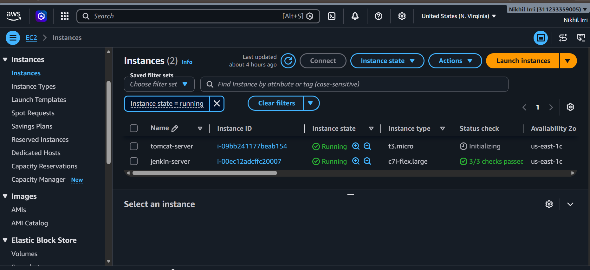
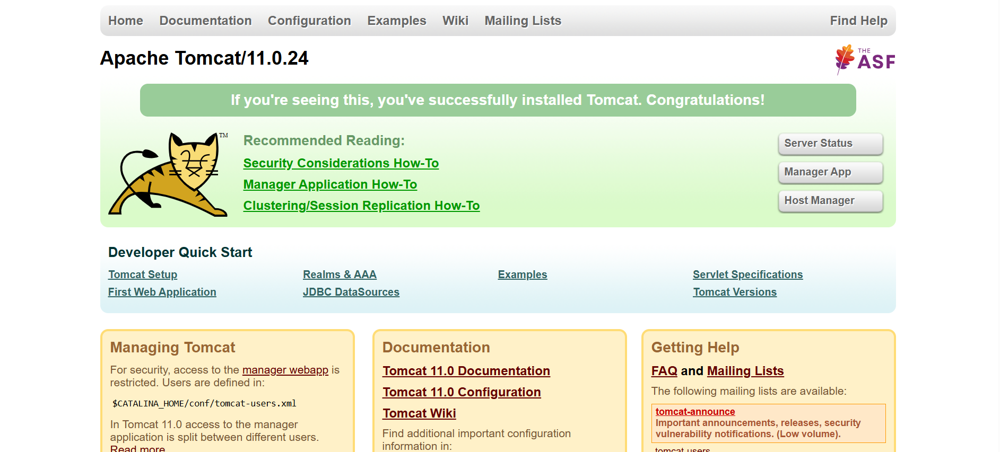
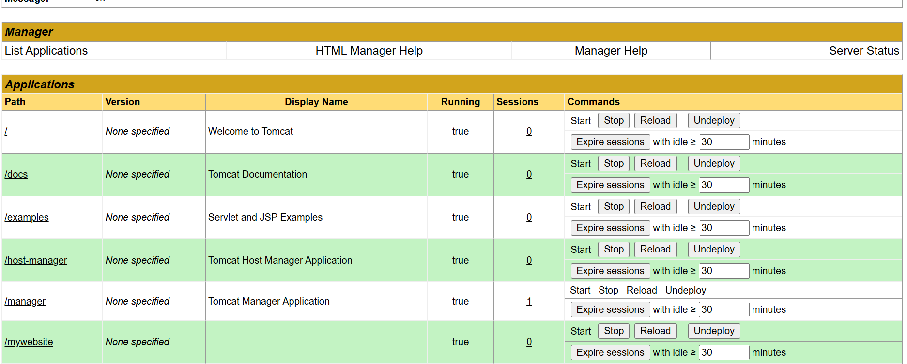
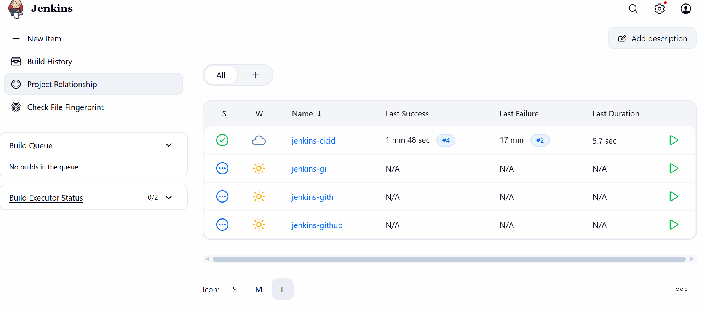
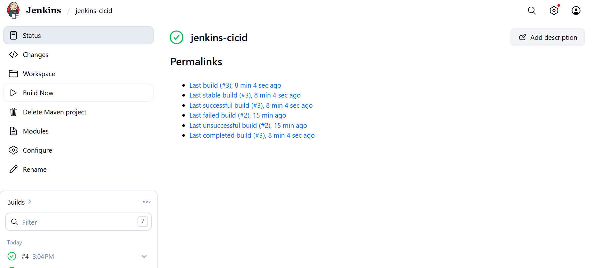
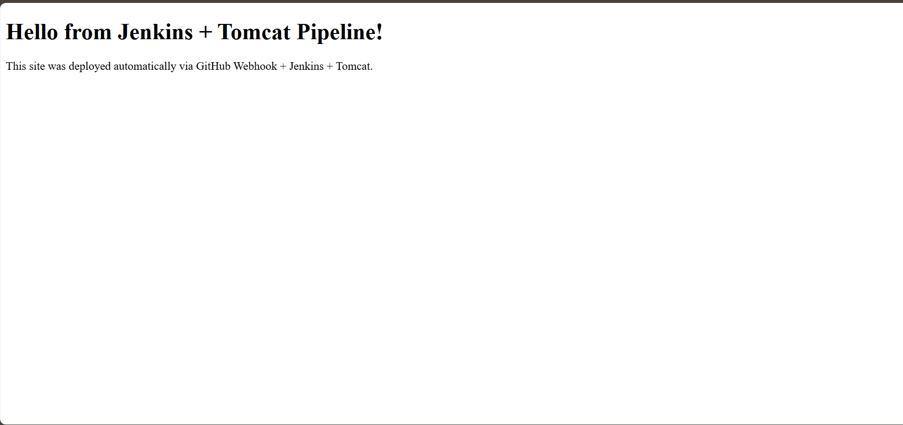

# 🚀 CI/CD Pipeline with Jenkins + Tomcat + GitHub Webhook

This project demonstrates a simple **CI/CD (Continuous Integration / Continuous Deployment)** pipeline using **Jenkins** and **Apache Tomcat** on **AWS EC2**. Whenever code is pushed to GitHub, a webhook automatically triggers Jenkins to build the project and deploy it to Tomcat — with zero manual steps.

---

## 📌 Project Overview

**Flow:**

```
Developer pushes code to GitHub
        │
        ▼
GitHub Webhook triggers Jenkins
        │
        ▼
Jenkins pulls the latest code & builds it (Maven/Ant/Shell)
        │
        ▼
Jenkins deploys the build (.war file) to Tomcat Server
        │
        ▼
Website is live and updated automatically
```

**Tech Stack:**
- **GitHub** – Source code repository
- **Jenkins** – Automation / CI-CD server
- **Apache Tomcat** – Application server (hosts the deployed website)
- **AWS EC2** – Cloud servers hosting Jenkins and Tomcat

---

## 🖥️ Infrastructure Setup

Two separate EC2 instances were created on AWS so that Jenkins and Tomcat run independently (closer to a real production setup):

| Server Name    | Purpose                  | Instance Type |
|-----------------|---------------------------|----------------|
| `jenkin-server` | Runs Jenkins (CI/CD engine) | c7i-flex.large |
| `tomcat-server` | Runs Tomcat (Web/App server) | t3.micro       |


*Both EC2 instances up and running in AWS Console.*

---

## 🔧 Step-by-Step Setup

### Step 1: Launch EC2 Instances
1. Log in to AWS Console → EC2 → **Launch Instance**.
2. Launch **two** Ubuntu instances:
   - One for **Jenkins**
   - One for **Tomcat**
3. Open the required ports in the **Security Group**:
   - `22` → SSH
   - `8080` → Jenkins / Tomcat default port
   - `80` / `443` → (optional, if using a reverse proxy)

---

### Step 2: Install Jenkins (on `jenkin-server`)

```bash
sudo apt update
sudo apt install openjdk-17-jdk -y

curl -fsSL https://pkg.jenkins.io/debian-stable/jenkins.io-2023.key | sudo tee \
  /usr/share/keyrings/jenkins-keyring.asc > /dev/null

echo deb [signed-by=/usr/share/keyrings/jenkins-keyring.asc] \
  https://pkg.jenkins.io/debian-stable binary/ | sudo tee \
  /etc/apt/sources.list.d/jenkins.list > /dev/null

sudo apt update
sudo apt install jenkins -y

sudo systemctl start jenkins
sudo systemctl enable jenkins
```

- Access Jenkins at: `http://<jenkins-server-ip>:8080`
- Unlock Jenkins using the initial admin password:
  ```bash
  sudo cat /var/lib/jenkins/secrets/initialAdminPassword
  ```
- Install **Suggested Plugins** and create your admin user.

---

### Step 3: Install Tomcat (on `tomcat-server`)

```bash
sudo apt update
sudo apt install openjdk-17-jdk -y

cd /opt
sudo wget https://dlcdn.apache.org/tomcat/tomcat-11/v11.0.24/bin/apache-tomcat-11.0.24.tar.gz
sudo tar -xvzf apache-tomcat-11.0.24.tar.gz
sudo mv apache-tomcat-11.0.24 tomcat

sudo /opt/tomcat/bin/startup.sh
```

- Access Tomcat at: `http://<tomcat-server-ip>:8080`


*Default Tomcat 11 welcome page confirming successful installation.*

#### Enable Tomcat Manager Access
Edit `conf/tomcat-users.xml` and add a user with `manager-gui` and `manager-script` roles so Jenkins can deploy remotely:

```xml
<role rolename="manager-gui"/>
<role rolename="manager-script"/>
<user username="admin" password="your-password" roles="manager-gui,manager-script"/>
```

Restart Tomcat after this change:
```bash
sudo /opt/tomcat/bin/shutdown.sh
sudo /opt/tomcat/bin/startup.sh
```


*Tomcat Manager showing deployed applications, including the custom `/mywebsite` app.*

> ⚠️ **Note:** By default, Tomcat Manager only allows access from `localhost`. If Jenkins is on a different server, edit `webapps/manager/META-INF/context.xml` and comment out or update the `Valve` restricting remote IPs.

---

### Step 4: Install Required Jenkins Plugins

On the Jenkins dashboard → **Manage Jenkins → Plugins**, install:
- **Git Plugin**
- **GitHub Integration Plugin**
- **Deploy to Container Plugin** (for deploying `.war` files to Tomcat)
- **Pipeline Plugin**

---

### Step 5: Add Tomcat Credentials in Jenkins

1. Go to **Manage Jenkins → Credentials → Global → Add Credentials**.
2. Select type: **Username with password**.
3. Enter the Tomcat manager username/password created earlier.
4. Give it an ID like `tomcat-creds` (used later in the pipeline).

---

### Step 6: Create the Jenkins Job

1. Jenkins Dashboard → **New Item**.
2. Enter a name (e.g., `jenkins-cicid`) → select **Freestyle project** or **Pipeline** → OK.
3. Under **Source Code Management**, select **Git** and paste your GitHub repo URL.
4. Under **Build Triggers**, check **GitHub hook trigger for GITScm polling**.
5. Under **Build/Post-build Actions**:
   - Add a **build step** (e.g., `mvn clean package` if it's a Maven project, or a simple shell script for a static site).
   - Add **Deploy war/ear to a container** as a post-build action → select your Tomcat URL and credentials.
6. Save the job.


*Jenkins dashboard showing the CI/CD job (`jenkins-cicid`) along with other test jobs.*

---

### Step 7: Configure GitHub Webhook

1. Go to your GitHub repository → **Settings → Webhooks → Add webhook**.
2. **Payload URL:**
   ```
   http://<jenkins-server-ip>:8080/github-webhook/
   ```
3. **Content type:** `application/json`
4. **Trigger:** Just the `push` event.
5. Save the webhook.

> ✅ Now, every time you `git push` to this repository, GitHub will automatically notify Jenkins to start a new build.

---

### Step 8: Run the Pipeline

- Trigger a build manually (**Build Now**) the first time to confirm everything works, or simply push a commit to GitHub.
- Jenkins will:
  1. Pull the latest code from GitHub.
  2. Build the project.
  3. Deploy the artifact to the Tomcat server automatically.


*Job status page showing successful build (#3) and permalinks for last stable/successful builds.*

---

### Step 9: Verify the Deployment

Visit your deployed website on the Tomcat server:

```
http://<tomcat-server-ip>:8080/mywebsite
```


*The final deployed website — confirming the CI/CD pipeline works end-to-end via GitHub Webhook → Jenkins → Tomcat.*

---

## 📁 Suggested Repository Structure

```
your-repo/
├── src/                 # Your application source code
├── Jenkinsfile          # (optional) Pipeline-as-code definition
├── pom.xml              # (if using Maven)
├── screenshots/         # Screenshots used in this README
└── README.md
```

---

## 🧩 Example Jenkinsfile (Pipeline-as-Code)

If you prefer a declarative pipeline instead of a Freestyle job:

```groovy
pipeline {
    agent any

    stages {
        stage('Checkout') {
            steps {
                git branch: 'main', url: 'https://github.com/your-username/your-repo.git'
            }
        }

        stage('Build') {
            steps {
                sh 'mvn clean package'
            }
        }

        stage('Deploy to Tomcat') {
            steps {
                deploy adapters: [tomcat9(credentialsId: 'tomcat-creds', url: 'http://<tomcat-server-ip>:8080/')],
                       contextPath: 'mywebsite',
                       war: '**/*.war'
            }
        }
    }
}
```

---

## 🐞 Troubleshooting

| Issue | Fix |
|-------|-----|
| Webhook not triggering build | Check GitHub webhook "Recent Deliveries" tab for errors; confirm Jenkins URL is publicly reachable |
| 403 error on Tomcat Manager | Update `manager/META-INF/context.xml` to allow Jenkins server's IP |
| Build fails at deploy stage | Verify Tomcat credentials & manager-script role are set correctly |
| Port 8080 not accessible | Check AWS Security Group inbound rules |

---

## 📸 Screenshots Summary

| # | Screenshot | Description |
|---|-------------|-------------|
| 1 | `01-deployed-website.png` | Final deployed website on Tomcat |
| 2 | `02-jenkins-job-status.png` | Jenkins job build history & permalinks |
| 3 | `03-jenkins-dashboard.png` | Jenkins dashboard with all jobs |
| 4 | `04-tomcat-home.png` | Default Tomcat installation page |
| 5 | `05-tomcat-manager.png` | Tomcat Manager application list |
| 6 | `06-aws-ec2-instances.png` | AWS EC2 instances (Jenkins + Tomcat servers) |

---

## 🙌 Author

**Nikhil Irri**
Simple CI/CD demo project — GitHub + Jenkins + Tomcat + AWS EC2.

---

### ⭐ If this helped you, consider giving the repo a star!
